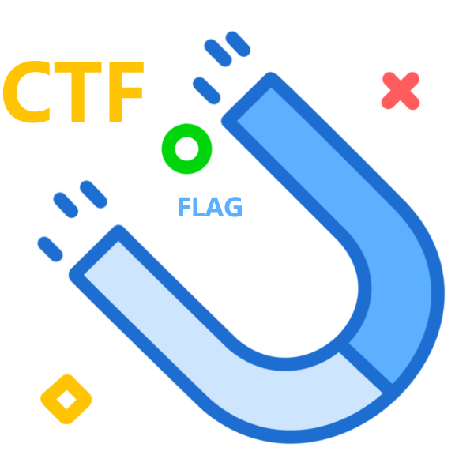

# magnetos

[](https://travis-ci.org/restran/magnetos)[](https://coveralls.io/github/restran/magnetos?branch=master)[](https://pypi.python.org/pypi/magnetos/)

一款帮你在 CTF 比赛中加速解题的工具

<div style="max-width: 270px; margin: 0 auto; ">

</div>


## 依赖的第三方工具

- zsteg
- pngcheck
- [stegdetect](https://github.com/abeluck/stegdetect) 
- exiftool

```
apt install pngcheck
apt install libimage-exiftool-perl
gem install zsteg
wget http://launchpadlibrarian.net/16746333/stegdetect_0.6-6_amd64.deb
dpkg -i stegdetect_0.6-6_amd64.deb
```

## 安装方法

    pip3 install magnetos

## 提供的工具

以下工具可以在命令下直接执行

- what_format，类似 binwalk 和 foremost，但可以分离出一些其他文件，例如 psd
- what_code_scheme，检测编码类型
- what_encode，自动检测文件编码并进行模糊测试
- what_steg，隐写题目自动化解题工具
- file_hash，计算文件hash
- file_strings，与 strings 命令相同，但是会自动过滤掉\0
- find_ctf_flag，根据 flag 特征从文本文件或目录中查找可能的 flag
- reverse_proxy
- steg_hide_break
